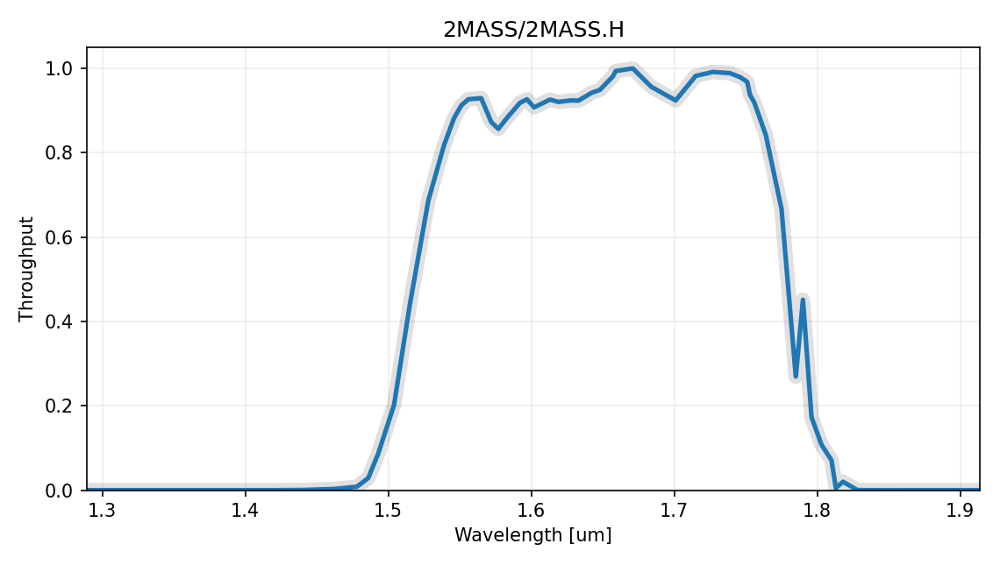
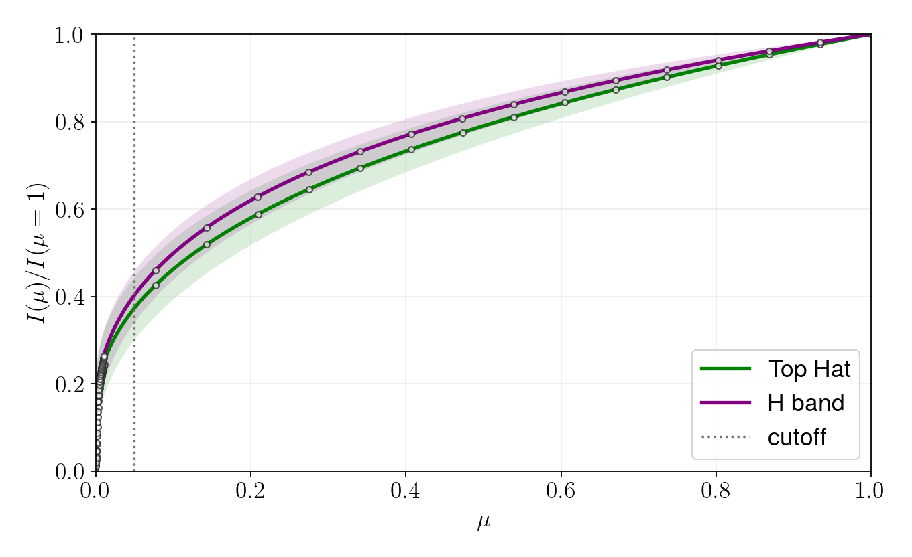
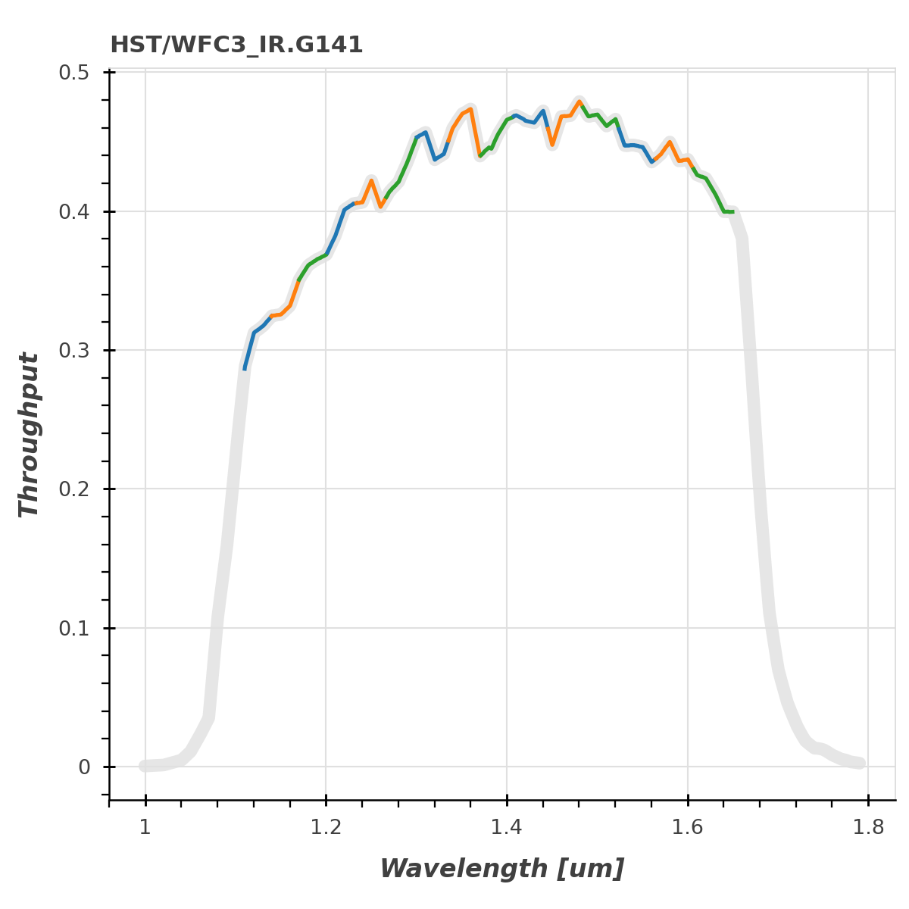

.. _LimbDarkening:

Calculate Limb Darkening Coefficients
=====================================

To calculate the limb darkening coefficients, we need a model grid.

In our first example, we use the Phoenix ACES models but any grid can be loaded into a modelgrid.ModelGrid() object if the spectra are stored as FITS files.

Two model grids are available in the EXOCTK_DATA directory and have corresponding child classes for convenience. The Phoenix ACES models and the Kurucz ATLAS9 models can be loaded with the modelgrid.ACES() and modelgrid.ATLAS9() classes respectively.

We can also use the resolution argument to resample the model spectra. This greatly speeds up the caluclations.

.. code-block:: python

    from exoctk import modelgrid
    model_grid = modelgrid.ACES(resolution=700)
    print(model_grid.data)

.. code-block:: text

    1056 models loaded from $EXOCTK_DATA/modelgrid/ACES/
     Teff  logg FeH          DATE        ...    Lbol       PHXMXLEN                            filename
    ------ ---- ---- ------------------- ... ---------- ------------- ----------------------------------------------------------
    5800.0  3.0  0.0 2013-02-13 17:35:34 ... 1.5138e+35 1.51295483542 lte05800-3.00-0.0.PHOENIX-ACES-AGSS-COND-SPECINT-2011.fits
    7600.0  5.0  0.5 2013-02-16 04:47:14 ... 5.4735e+33  1.3609992311 lte07600-5.00+0.5.PHOENIX-ACES-AGSS-COND-SPECINT-2011.fits
    4100.0  5.0  0.0 2013-02-13 22:12:53 ... 1.3493e+32 1.90153163552 lte04100-5.00-0.0.PHOENIX-ACES-AGSS-COND-SPECINT-2011.fits
    6900.0  4.0 -0.5 2013-02-15 21:47:15 ... 3.6783e+34 1.21685706454 lte06900-4.00-0.5.PHOENIX-ACES-AGSS-COND-SPECINT-2011.fits
    4400.0  3.0  0.5 2013-02-16 08:31:04 ... 2.8855e+34 1.74780474088 lte04400-3.00+0.5.PHOENIX-ACES-AGSS-COND-SPECINT-2011.fits
       ...  ...  ...                 ... ...        ...           ...                                                        ...
    3300.0  3.0  0.5 2013-05-19 00:40:52 ... 5.1356e+33 2.10354852144 lte03300-3.00+0.5.PHOENIX-ACES-AGSS-COND-SPECINT-2011.fits
    3500.0  4.0 -0.5 2013-05-18 22:00:26 ... 6.2657e+32 2.19676308175 lte03500-4.00-0.5.PHOENIX-ACES-AGSS-COND-SPECINT-2011.fits
    3600.0  5.0  0.0 2013-05-18 20:36:44 ... 6.1832e+31 2.29007335395 lte03600-5.00-0.0.PHOENIX-ACES-AGSS-COND-SPECINT-2011.fits
    5700.0  4.0  0.0 2013-02-13 18:07:17 ... 1.1689e+34 1.57574414643 lte05700-4.00-0.0.PHOENIX-ACES-AGSS-COND-SPECINT-2011.fits
    6600.0  3.0 -0.5 2013-02-15 21:12:48 ... 3.2868e+35 1.09919895654 lte06600-3.00-0.5.PHOENIX-ACES-AGSS-COND-SPECINT-2011.fits
    6000.0  4.0  0.5 2013-02-16 05:32:33 ... 1.5904e+34 1.53258079748 lte06000-4.00+0.5.PHOENIX-ACES-AGSS-COND-SPECINT-2011.fits
    Length = 1056 rows

Now let's customize it to our desired effective temperature, surface gravity, metallicity, and wavelength ranges by running the customize() method on our grid.

.. code-block:: python

    model_grid.customize(Teff_rng=(2500,2600), logg_rng=(5,5.5), FeH_rng=(-0.5,0.5))

.. code-block:: text

    12/1056 spectra in parameter range Teff:  (2500, 2600) , logg:  (5, 5.5) , FeH:  (-0.5, 0.5) , wavelength:  (<Quantity 0. um>, <Quantity 40. um>)
    Loading flux into table...
    100.00 percent complete!

Now we can caluclate the limb darkening coefficients using the limb_darkening_fit.LDC() class.

.. code-block:: python

    from exoctk.limb_darkening import limb_darkening_fit as lf
    ld = lf.LDC(model_grid)

We just need to specify the desired effective temperature, surface gravity, metallicity, and the function(s) to fit to the limb darkening profile (including 'uniform', 'linear', 'quadratic', 'square-root', 'logarithmic', 'exponential', and 'nonlinear').

We can do this with for a single model on the grid:

.. code-block:: python

    teff, logg, FeH = 2500, 5, 0
    ld.calculate(teff, logg, FeH, 'quadratic', name='on-grid', color='blue')

.. code-block:: text

    Closest model to [2500, 5, 0] => [2500.0, 5.0, 0.0]
    Saving model 'ACES_2500.0_5.0_0.0'
    Bandpass trimmed to 0.05 um - 2.5999 um
    1 bins of 100 pixels each.

Or a single model off the grid, where the spectral intensity model is directly interpolated before the limb darkening coefficients are calculated. This takes a few seconds when calculating:

.. code-block:: python

    teff, logg, FeH = 2511, 5.22, 0.04
    ld.calculate(teff, logg, FeH, 'quadratic', name='off-grid', color='red', interp=True)

.. code-block:: text

    Interpolating grid point [2511/5.22/0.04]...
    Run time in seconds:  5.451060056686401
    Saving model 'ACES_2511_5.22_0.04'
    Bandpass trimmed to 0.05 um - 2.5999 um
    1 bins of 100 pixels each.

Now we can see the results table using the following command:

.. code-block:: python

    print(ld.results)

.. code-block:: text

      name    Teff  logg FeH   profile   filter ...          bandpass          color   c1    e1    c2    e2
    -------- ------ ---- ---- --------- ------- ... -------------------------- ----- ----- ----- ----- -----
     on-grid 2500.0  5.0  0.0 quadratic Top Hat ... <Filter 'Top Hat' from ''>  blue 0.218 0.024 0.391 0.033
    off-grid 2511.0 5.22 0.04 quadratic Top Hat ... <Filter 'Top Hat' from ''>   red 0.224 0.025 0.398 0.033

Using a Photometric Bandpass
----------------------------

Above we caluclated the limb darkening in a particular wavelength range set when we ran the ``customize()`` method on our ``core.ModelGrid()`` object.

Additionally, we can calculate the limb darkening through a particular photometric bandpass.

First we have to create a ``svo_filters.svo.Filter()`` object which we can then pass to the calculate method. Let's use 2MASS H-band for this example.

.. code-block:: python

    from svo_filters import svo
    H_band = svo.Filter('2MASS.H')
    H_band.plot()

Now we can tell ``LDC.calculate()`` to apply the filter to the spectral intensity models before calculating the limb darkening coefficients using the bandpass argument. We'll compare the results of using the bandpass (purple line) to the results where we just used the wavelength window of 1.4-1.9 :math:`\mathcal $mu$ m` (green line).

.. code-block:: python

    ld = lf.LDC(model_grid)
    teff, logg, FeH = 2511, 5.22, 0.04
    ld.calculate(teff, logg, FeH, '4-parameter', name='Top Hat', color='green', interp=True)
    ld.calculate(teff, logg, FeH, '4-parameter', bandpass=H_band, name='H band', color='purple', interp=True)
    ld.plot(show=True)

.. code-block:: text

    Interpolating grid point [2511/5.22/0.04]...
    Run time in seconds:  5.915054082870483
    Saving model 'ACES_2511_5.22_0.04'
    Bandpass trimmed to 0.05 um - 2.5999 um
    1 bins of 100 pixels each.

Using a Grism
-------------

Grisms are also supported. We can use the whole grism wavelength range (as if it was a bandpass) or truncate the grism to consider arbitrary wavelength ranges by setting the ``wave_min`` and ``wave_max`` arguments.

.. code-block:: python

    from astropy import units
    G141 = svo.Filter('WFC3_IR.G141', wave_min=1.11*units.um, wave_max=1.65*units.um, n_bins=15)
    G141.plot()

.. code-block:: text

    Bandpass trimmed to 1.11 um - 1.65 um
    15 bins of 431 pixels each.

Now we can caluclate the LDCs for each of the 15 wavelength bins of the G141 grism we just created, where the first column in the table is the bin center. This is not very useful to plot but... why not?

.. code-block:: python

    teff, logg, FeH = 2511, 5.22, 0.04
    ld = lf.LDC(model_grid)
    ld.calculate(teff, logg, FeH, '4-parameter', bandpass=G141, interp=True)
    print(ld.results)

.. code-block:: text

    Interpolating grid point [2511/5.22/0.04]...
    Run time in seconds:  5.983066082000732
    Saving model 'ACES_2511_5.22_0.04'
     name  Teff  logg FeH    profile        filter      ...   c2     e2    c3     e3    c4     e4
    ----- ------ ---- ---- ----------- ---------------- ... ------ ----- ------ ----- ------ -----
    1.125 2511.0 5.22 0.04 4-parameter HST/WFC3_IR.G141 ...  0.418 0.011 -0.599 0.011  0.193 0.004
    1.155 2511.0 5.22 0.04 4-parameter HST/WFC3_IR.G141 ... -1.135 0.016  0.454 0.017 -0.071 0.006
    1.186 2511.0 5.22 0.04 4-parameter HST/WFC3_IR.G141 ... -1.065  0.01  0.458 0.011 -0.086 0.004
    1.218 2511.0 5.22 0.04 4-parameter HST/WFC3_IR.G141 ...   -1.3  0.01    0.7 0.011 -0.168 0.004
    1.250 2511.0 5.22 0.04 4-parameter HST/WFC3_IR.G141 ... -0.838 0.008  0.321 0.009 -0.052 0.003
    ...    ...  ...  ...         ...              ... ...    ...   ...    ...   ...    ...   ...
    1.427 2511.0 5.22 0.04 4-parameter HST/WFC3_IR.G141 ...  0.947 0.012 -0.775 0.013  0.209 0.005
    1.465 2511.0 5.22 0.04 4-parameter HST/WFC3_IR.G141 ...  0.916 0.033 -0.893 0.035  0.273 0.013
    1.504 2511.0 5.22 0.04 4-parameter HST/WFC3_IR.G141 ...  0.611 0.037 -0.776 0.039   0.26 0.015
    1.544 2511.0 5.22 0.04 4-parameter HST/WFC3_IR.G141 ...  0.291  0.05 -0.623 0.053  0.235  0.02
    1.586 2511.0 5.22 0.04 4-parameter HST/WFC3_IR.G141 ... -0.825  0.01  0.308 0.011 -0.049 0.004
    1.628 2511.0 5.22 0.04 4-parameter HST/WFC3_IR.G141 ... -1.126 0.005   0.57 0.005 -0.131 0.002
    Length = 15 rows

Calculating SPAM Coefficients
-----------------------------

The ``4-parameter`` coefficients can also be transformed into Synthetic-Photometry/Atmosphere-Model (SPAM) coefficients. SPAM coefficients depend on the planet geometry, so the calculation needs either a ``planet_name`` that can be resolved by ExoCTK or an explicit ``planet_data`` dictionary. Supplying the dictionary directly keeps the calculation reproducible and avoids a remote query.

.. code-block:: python

    planet_data = {
        'transit_duration': 0.10,
        'orbital_period': 3.0,
        'Rp/Rs': 0.1,
        'a/Rs': 10.0,
        'inclination': 88.0,
        'eccentricity': 0.0,
        'omega': 90.0,
    }

    ld.spam(planet_data=planet_data, profiles=['quadratic'], ndatapoints=200)
    print(ld.spam_results[['name', 'profile', 'c1', 'c2']])

.. code-block:: text

     name  profile    c1    c2
    ----- --------- ----- -----
    1.125 quadratic 0.294 0.362
    1.155 quadratic  0.22 0.314
    1.186 quadratic 0.223 0.315
    1.218 quadratic 0.192 0.295
    1.250 quadratic 0.209 0.306
    ...       ...   ...   ...
    1.427 quadratic  0.36 0.406
    1.465 quadratic 0.336  0.39
    1.504 quadratic 0.294 0.363
    1.544 quadratic 0.274 0.349
    1.586 quadratic 0.209 0.306
    1.628 quadratic 0.182 0.288
    Length = 15 rows

The full ``ld.spam_results`` table also keeps the planet properties used for the transformation, along with the original filter and model-grid metadata.
